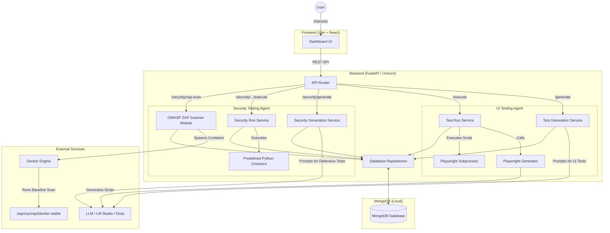
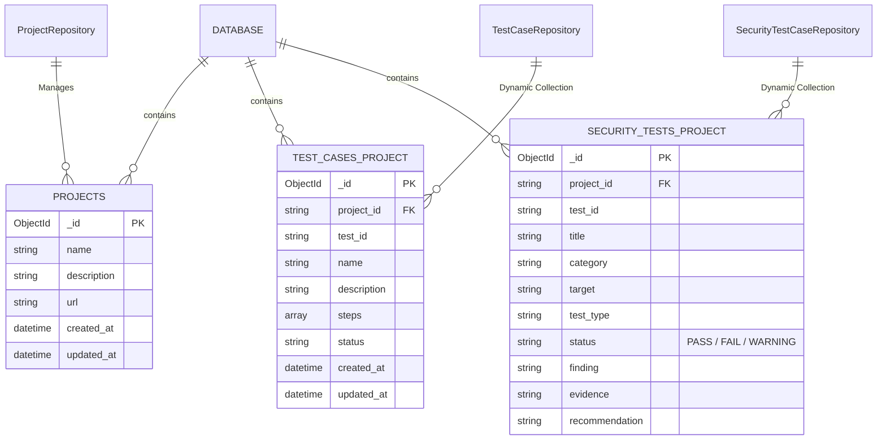

# PBL 2.2 - Run Guide

This repository has two separate apps:

- `backend` (FastAPI)
- `frontend` (Vite + React)

Run them in separate terminals.

## 1) Start backend

```bash
cd backend
uv run uvicorn app.main:app --reload
```

Backend URL: `http://127.0.0.1:8000`

Quick health check:

```bash
curl http://127.0.0.1:8000/
```

Expected response:

```json
{"message":"Agentic Testing System Running"}
```

## 2) Start frontend

```bash
cd frontend
npm run dev
```

Frontend URL: `http://localhost:5173`

## Common startup mistakes

- Running `npm run dev` from repo root (fails because root has no `package.json`).
- Running backend with system Python that does not have `uvicorn`.
- Not running backend and frontend in separate terminals.

## 3) System Architecture

Below is the updated system design architecture detailing both the UI Testing and Security Testing pipelines.



## 4) Database Connectivity & Schema

The following diagram details the collections inside MongoDB and how the backend repositories interact with them.


