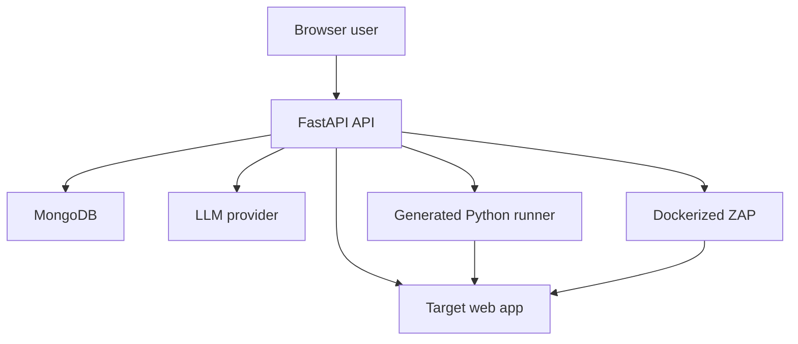

# AQUA Threat Model

## Executive summary

AQUA is a FastAPI/Vite application that accepts target URLs and project data, calls LLM providers, stores test cases in MongoDB, and executes generated Playwright or ZAP work. The highest risks are unauthenticated project and execution APIs, server-side requests to attacker-selected URLs, execution of LLM-generated Python with the application environment, and the absence of tenant isolation and durable audit history. This model is repository-grounded and uses explicit assumptions because no deployment context was supplied.

## Scope and assumptions

In scope: `backend/app/`, `frontend/src/`, `backend/pyproject.toml`, `backend/requirements.txt`, `backend/docs/`, and runtime behavior exposed by the FastAPI routes. Runtime, local development, and test/example artifacts are considered separately.

Out of scope: the security of MongoDB, LM Studio, Groq, Docker, target applications, browser binaries, GitHub, and the host operating system beyond the integration boundaries described here.

Assumptions used for prioritization:

- The service may eventually be reachable by multiple users, even though the README currently describes a local/demo setup.
- Project URLs and generated test content can be attacker-controlled or influenced by untrusted target pages.
- MongoDB, LLM endpoints, and Docker are operator-controlled dependencies.
- The application is expected to test systems only when the operator has authorization.
- Generated scripts may contain credentials or target-specific data during execution.

Open questions: Is the first deployment local-only or internet-facing? Is multi-user tenancy required? What data sensitivity and retention requirements apply to prompts, cookies, response bodies, screenshots, and DOM artifacts?

## System model

### Primary components

- Browser: React/Vite SPA with local persisted auth and optional route JWT state (`frontend/src/App.jsx`, `frontend/src/api/client.js`).
- API server: FastAPI/Uvicorn routes and lifespan-managed Mongo connection (`backend/app/main.py`, `backend/app/api/v1/router.py`).
- Persistence: Motor/MongoDB repositories for projects and project-name-derived test collections (`backend/app/db/mongodb.py`, `backend/app/db/repositories/`).
- AI and RAG: OpenAI-compatible LM Studio/Groq clients and local Chroma/HuggingFace embeddings (`backend/app/core/llm/`, `backend/app/core/rag/`).
- UI test runner: Playwright browser scraping, LLM/deterministic script generation, Python subprocess execution, and artifact output (`backend/app/core/browser/`, `backend/app/services/playwright_generator.py`, `backend/app/services/playwright_runner.py`).
- Security runner: passive HTTP checkers and Dockerized OWASP ZAP baseline scans (`backend/app/services/security_checkers.py`, `backend/app/services/zap_scanner.py`).

### Data flows and trust boundaries

- Browser → API server: JSON project names, URLs, prompts, credentials, and run commands over HTTP. No route-level authentication or rate limiting is enforced (`backend/app/api/v1/`, `backend/app/api/v1/auth.py`).
- API server → MongoDB: project, user, generated test, and finding documents over the Motor driver. Repository methods convert IDs but do not enforce ownership or uniqueness (`backend/app/db/repositories/`).
- API server → target URL: Playwright and `httpx` requests to a URL supplied through API/project data. URL scope and private-network protections are absent (`backend/app/core/browser/playwright_controller.py`, `backend/app/services/security_checkers.py`).
- API server → LLM: prompts containing target DOM context and test data over provider-specific HTTP. Provider trust, prompt confidentiality, and output validation are not independently enforced (`backend/app/core/llm/openai_compat_client.py`).
- API server → generated Python subprocess: generated code, inherited environment, runtime inputs, and filesystem artifact paths cross a privilege boundary without sandboxing (`backend/app/services/playwright_runner.py`).
- API server → Docker/ZAP: target URL and mounted report directory cross into Docker. The scan is synchronous and requires host Docker access (`backend/app/services/zap_scanner.py`).

#### Diagram

## Assets and security objectives

| Asset | Why it matters | Security objective |
|---|---|---|
| User passwords and access tokens | Account takeover and unauthorized project access | C/I |
| Project URLs and target credentials | May identify private systems or enable access to them | C/I |
| Generated scripts and subprocess environment | Can execute code or exfiltrate secrets | C/I/A |
| MongoDB project/test/finding records | Integrity affects test results and tenant isolation | C/I/A |
| DOM, screenshots, response bodies, and logs | May contain PII, cookies, tokens, or business data | C |
| LLM prompts and outputs | Prompt leakage or manipulated output can affect execution | C/I |
| Docker/worker capacity and target availability | Scans can consume resources or harm targets | A |

## Attacker model

### Capabilities

An unauthenticated network client may call documented routes if the API is exposed. A user may submit arbitrary project names, target URLs, prompts, API payloads, and runtime input values. A malicious target page may influence scraped DOM content and LLM-generated test code. A compromised or manipulated LLM response may contain arbitrary Python.

### Non-capabilities

This model does not assume MongoDB administrator access, control of the host kernel, compromise of the LLM provider, or authorization to attack third-party systems. If the deployment is strictly single-user and localhost-only, likelihood for remote threats decreases but code-execution and SSRF risks remain relevant.

## Entry points and attack surfaces

| Surface | How reached | Trust boundary | Notes | Evidence |
|---|---|---|---|---|
| Auth register/login | `POST /api/v1/auth/*` | Browser → API → MongoDB | SHA-256 passwords; returned tokens are not verified | `backend/app/api/v1/auth.py` |
| Project CRUD | `GET/POST /api/v1/projects/` | Browser → API → MongoDB | No ownership, uniqueness, or rate limits | `backend/app/api/v1/projects.py` |
| Functional generation | `POST /api/v1/generate/` | Browser → API → target/LLM/Mongo | Fetches URL and persists model output | `backend/app/api/v1/test_generation.py` |
| Functional execution | `POST /api/v1/{project}/{test}` | Browser → API → generated subprocess | Executes generated Python and writes artifacts | `backend/app/api/v1/test_run.py` |
| LLM test endpoint | `POST /api/v1/llm/test` | Browser → API → LLM | General prompt proxy; no authorization | `backend/app/api/v1/llm.py` |
| Security generation/execution | `/api/v1/security/*` | Browser → API → target/Mongo | Active probes and findings; no UI or scope policy | `backend/app/api/v1/security_tests.py` |
| ZAP scan | `POST /api/v1/security/zap-scan/{project}` | Browser → API → Docker/target | Host Docker capability and arbitrary project URL | `backend/app/services/zap_scanner.py` |
| Artifact and runtime input path | Runner env/filesystem | API → subprocess/filesystem | Credentials may cross into child process and artifacts | `backend/app/services/playwright_runner.py` |

## Top abuse paths

1. Attacker calls generation with a cloud metadata/private URL → browser fetches it → DOM or response data is sent to the LLM and persisted.
2. Attacker creates a project containing a malicious target → LLM produces Python with unintended commands → runner executes it with inherited environment access.
3. Attacker calls project/test routes without a valid session → API returns or mutates another project’s records because tokens are never checked and ownership is absent.
4. Attacker submits a target that redirects to an internal service → security checker or ZAP follows the redirect → internal data is exposed through findings or logs.
5. Malicious target DOM injects prompt instructions → LLM emits unsafe selectors or code → subprocess runs the manipulated script.
6. Attacker repeatedly starts ZAP or generation jobs → synchronous browser/Docker/LLM work consumes worker capacity → service availability degrades.
7. A user supplies credentials to resume a waiting test → generated scripts or captured DOM/artifacts expose those credentials → sensitive target access is compromised.

## Threat model table

| Threat ID | Threat source | Prerequisites | Threat action | Impact | Impacted assets | Existing controls (evidence) | Gaps | Recommended mitigations | Detection ideas | Likelihood | Impact severity | Priority |
|---|---|---|---|---|---|---|---|---|---|---|---|---|
| TM-001 | Remote client | API exposed | Bypass authentication because tokens are not validated | Cross-user access and unauthorized actions | Tokens, Mongo records | Login/register response models (`backend/app/api/v1/auth.py`) | No JWT/session verification or route dependency | Add signed expiring tokens, auth dependency, project ownership, revocation/refresh policy | Alert on anonymous project/run calls and repeated auth failures | High | High | critical |
| TM-002 | Remote client / target owner | Generation or scan accepts arbitrary URL | SSRF to internal services, metadata endpoints, or loopback | Confidentiality loss and network pivot | Target data, credentials, availability | None beyond generic Pydantic strings (`backend/app/api/v1/test_generation.py`) | No scheme/host/IP/redirect policy | Centralize URL validation, DNS/IP checks, egress proxy, approved target registry | Log resolved IP, redirect chain, blocked host, and project/user | High | High | critical |
| TM-003 | Malicious target or LLM output | Functional test execution enabled | Execute arbitrary generated Python | Host secret theft, filesystem access, network abuse | Environment, artifacts, Mongo credentials | Subprocess timeout (`backend/app/services/playwright_runner.py`) | No sandbox, syscall limits, secret isolation, or code policy | Run isolated worker/container with minimal identity, no secrets, read-only filesystem, egress policy, CPU/memory limits | Capture script hash, sandbox identity, child process events, and violations | Medium | Critical | critical |
| TM-004 | Cross-project user | Multi-user deployment | Read or mutate another project/test by name or ID | Data disclosure and integrity loss | Mongo records, findings, artifacts | Project ID filters in repositories (`backend/app/db/repositories/`) | No authenticated owner/tenant filter; dynamic collections | Add owner/tenant IDs, authorization checks, stable collections, unique indexes | Audit denied cross-tenant access and unusual enumeration | High | High | critical |
| TM-005 | Malicious target page | DOM is scraped and placed in prompt | Prompt injection alters generated tests or code | Unsafe execution or misleading results | LLM integrity, scripts, test results | Prompts constrain output format (`backend/app/services/*generation_service.py`) | No content isolation, output policy, or review gate | Treat DOM as untrusted data, validate structured output, static scan scripts, require approval for risky actions | Store prompt/output hashes and flag suspicious code constructs | Medium | High | high |
| TM-006 | Authenticated user / compromised target | Security checker follows target redirects | Probe internal or sensitive endpoints | Confidentiality loss and target harm | Target data, worker capacity | Ten-second HTTP timeout (`backend/app/services/security_checkers.py`) | `verify=False`, no scope/redirect/private-IP controls | Add safe passive mode, redirect validation, explicit active-scan opt-in, rate and method limits | Record request scope, method, destination, and policy decision | Medium | High | high |
| TM-007 | Remote client | Security/ZAP routes exposed | Trigger repeated synchronous scans | Resource exhaustion and operational outage | API, Docker, target availability | Five-minute ZAP timeout (`backend/app/services/zap_scanner.py`) | No auth, queue, concurrency quota, or deduplication | Queue scans, enforce per-project quotas, cancel jobs, pin image, isolate worker | Metrics for queue depth, scan duration, Docker failures, and per-user quotas | High | Medium | high |
| TM-008 | Credentialed test user | Waiting/resume flow uses environment inputs | Expose secrets in generated scripts, DOM, artifacts, or logs | Credential compromise | Target credentials, artifacts, logs | Inputs are passed as environment variables (`backend/app/services/playwright_runner.py`) | No masking, retention, or secret reference model | Use secret references, redact output, isolate artifact access, expire runtime inputs | Secret-pattern scanning and artifact access audit | Medium | High | high |
| TM-009 | Malformed LLM response | Generation parser accepts model output | Persist duplicate/invalid test cases or misleading findings | Integrity and operator trust loss | Test records and reports | Pydantic models and JSON parsing (`backend/app/services/*generation_service.py`) | Weak uniqueness, fallback defaults such as `UNKNOWN`, no semantic validation | Validate against versioned schemas, reject duplicate IDs, require human review for security cases | Track parse failures, schema violations, and fallback rates | Medium | Medium | medium |

## Criticality calibration

- **Critical:** pre-auth cross-tenant access, arbitrary code execution, or SSRF that reaches sensitive internal resources. Examples: TM-001, TM-002, TM-003, TM-004.
- **High:** authenticated secret exposure, unsafe active scanning, prompt-to-code manipulation, or sustained service/resource abuse. Examples: TM-005, TM-006, TM-007, TM-008.
- **Medium:** invalid generated records, noisy evidence, or limited availability degradation where stronger controls constrain impact. Example: TM-009.
- **Low:** minor disclosure of non-sensitive metadata or local-only issues that require operator access and do not cross a trust boundary. No currently evidenced primary threat is assigned low while deployment exposure is unknown.

## Focus paths for security review

| Path | Why it matters | Related Threat IDs |
|---|---|---|
| `backend/app/api/v1/auth.py` | Token, password, and session design | TM-001, TM-004 |
| `backend/app/api/v1/` | Public route authorization and input contracts | TM-001, TM-002, TM-004, TM-007 |
| `backend/app/services/playwright_runner.py` | Generated-code privilege boundary | TM-003, TM-008 |
| `backend/app/services/playwright_generator.py` | LLM-to-code transformation | TM-003, TM-005 |
| `backend/app/core/browser/playwright_controller.py` | Server-side target fetching | TM-002, TM-005 |
| `backend/app/services/security_checkers.py` | Active HTTP probes and TLS behavior | TM-002, TM-006 |
| `backend/app/services/zap_scanner.py` | Docker and scan scope | TM-002, TM-007 |
| `backend/app/db/repositories/` | Tenant isolation and dynamic collections | TM-004, TM-009 |
| `backend/app/services/*generation_service.py` | Prompt and model-output validation | TM-005, TM-009 |

## Notes on use

This document is a first-pass model, not authorization to scan any target. Confirm deployment exposure, tenant model, data sensitivity, and active-testing policy before implementing the mitigations. The first implementation tasks should address TM-001 through TM-004 before adding broader API or security capabilities.

Quality check: runtime, dependency, and test/example concerns are separated; all discovered route families and trust boundaries are represented; assumptions and open questions are explicit; each major recommendation has repository evidence anchors.
