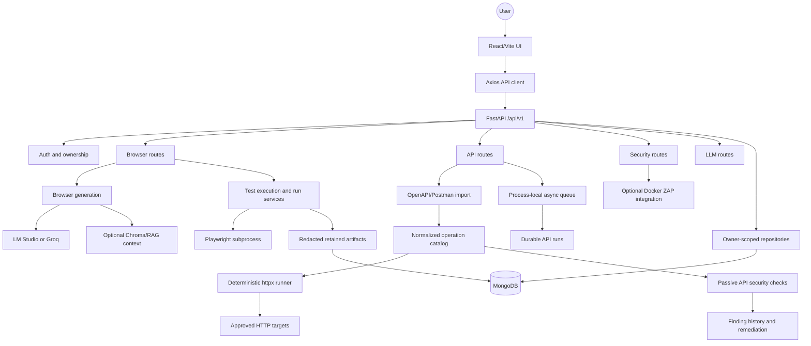
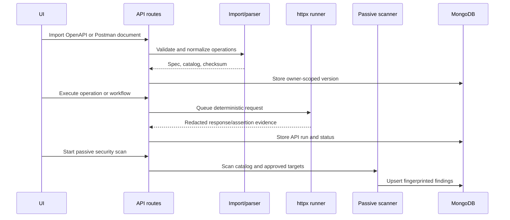

# AQUA System Architecture

AQUA has two user-facing testing paths behind one authenticated FastAPI service:

1. Browser testing turns natural-language or structured steps into Playwright scripts and executes them in a subprocess.
2. API testing imports an API contract, normalizes its operations, executes deterministic HTTP cases, and runs passive security analysis over the same operation catalog.

## Component view

## Frontend

The frontend is a Vite/React application with React Router, Axios, and Zustand stores for authentication and theme state. Its main surfaces are:

- `ProjectsPage` and `ProjectDetailPage` for project and browser-test workflows.
- `ApiTestingPage` for spec import, operation editing, API execution, workflows, run history, passive scans, and finding remediation.
- `LoginPage` and protected routing for authenticated access.
- `NeedsActionModal` for browser runs that require user input.

## Backend layers

`backend/app/api/v1/` contains route handlers grouped by capability. Models and persistence are separated from service logic:

- `models/` defines projects, test cases, API specs/operations, API runs/findings, shared run metadata, and status vocabulary.
- `db/repositories/` owns MongoDB access and owner-scoped queries. Project names are unique per owner; legacy per-project test collections enforce logical-ID uniqueness per project. A complete migration to stable project-ID collections remains planned.
- `services/` contains parsing/import, deterministic API execution, workflow execution, browser generation/execution, security checks, reporting, and the async job boundary.
- `core/` contains authentication, URL/SSRF policy, browser control, LLM clients, and RAG helpers.

## Run and job lifecycle

Shared statuses are `queued`, `running`, `waiting`, `passed`, `failed`, `warning`, and `cancelled`. API runs persist correlation IDs, timing, runner/generation metadata, evidence, and failure details. The current `AsyncJobQueue` provides bounded timeout, retry, and cancellation behavior inside one backend process; it is not a distributed worker and should not be horizontally scaled.

Browser execution remains subprocess-based so generated code does not execute inside the Uvicorn process. Secrets are passed only through controlled runtime inputs and are excluded from generated scripts, logs, and persisted evidence.

## API-testing flow

URL imports and target requests accept only HTTP(S), validate host policy and DNS results, block private/reserved targets by default, and do not follow redirects automatically. OpenAPI imports validate an explicit one-hop redirect before following it. DNS-rebinding-safe connection pinning and active/destructive probes are still deployment-policy work.

## Deployment boundaries

The default Compose stack contains MongoDB, the backend, and an Nginx-served frontend. LM Studio/Groq is external and optional unless strict LLM readiness is enabled. ZAP is an opt-in container profile. Keep `AUTH_SECRET_KEY` in the environment or a managed secret store; do not commit runtime `.env` files.

See [docs/DEPLOYMENT.md](docs/DEPLOYMENT.md) for commands, health checks, scaling limitations, and security notes.
